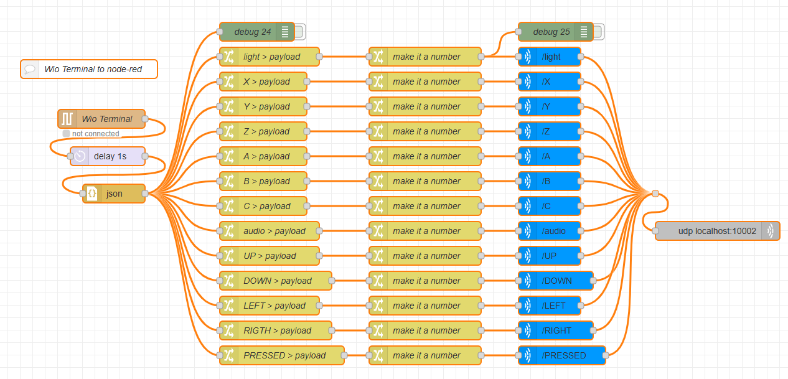

## Importing serial data in Touch Designer (via Node-RED)

## Programming the Wio Terminal 

We have to flash the Wio Terminal with this code that is sending all the sensors via serial in a JSON object. 

??? note "Arduino Code (serial2touchWIO.ino)"

    ```cpp
   
    --8<-- "Projects/serial2touch/serial2touchWIO/serial2touchWIO.ino"
    ```


## Receiving data via Node-RED


{ .glightbox width="400" } 

??? note "NOde-RED Flow"

    ```cpp
   
    --8<-- "Projects/serial2touch/serial2touchWIO/serial2touchWIO.ino"
    ```

