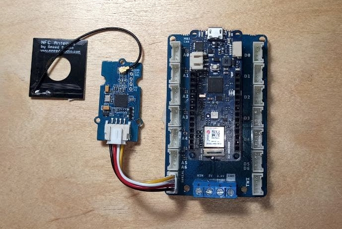

## Grove NFC

You can find a detailed wifi about this product on [his wiki](https://wiki.seeedstudio.com/Grove_NFC/) on Seeed's site.

In order to test it's working and behaviour you have to install the library in [`/Libraries`](https://github.com/vongomben/fluid-networks/tree/master/microntrollers/Libraries)

* Download [`NFC.zip`](https://github.com/vongomben/fluid-networks/raw/master/Libraries/NFC.zip)
* unzip and copy the 5 folders to the Arduino Library folder. You can follow [this guide for Windows](https://learn.adafruit.com/adafruit-all-about-arduino-libraries-install-use/installing-a-library) or [this guide for Mac OS](https://learn.adafruit.com/adafruit-all-about-arduino-libraries-install-use/installing-a-library-on-mac-osx) but you'll basically need to just paste it in.
* close and re-reun the Arduino IDE
* now you should be able to open the example you find in `File > Esamples > PN532 > readMifare.ino`

We are using the board in its `SERIAL` mode, so we are going to hook it up to the `SERIAL` labelled Grove connector of the MKR Carrier.

